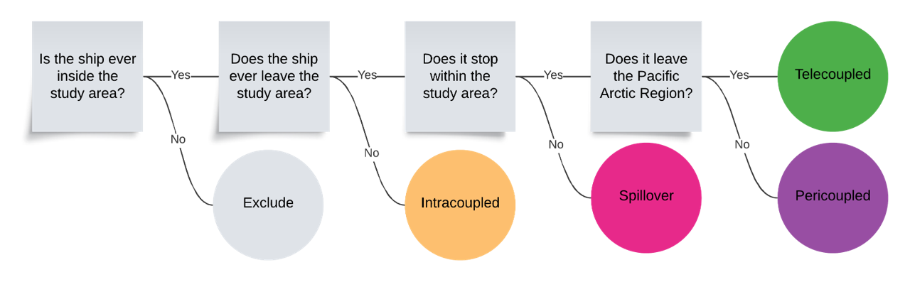

# Analysis Ready Vessel Traffic Data 

## Overview 

This repository contains code to convert monthly shapefiles of vessel tracklines produced in the [AIS_Processing](https://github.com/ArcticTelecouplingProject/AIS_Processing) repository into analysis-ready outputs for use in projects related to the [Arctic Telecoupling Project](https://arctictelecoupling.org). For more information on the data acquisition, cleaning, and processing that was used to generate the data input into this codebase, please refer to the [AIS_Processing](https://github.com/ArcticTelecouplingProject/AIS_Processing) repository. 

## Workflow 

### Metacoupling Analysis 

A key function of this repository is to categorize annual vessel movements into specific [metacoupling](https://www.canr.msu.edu/telecoupling/metacoupling/) types based on the patterns of their movement in relation to the study area and broader Pacific Arctic Region (Figure 1). 

Once categorized, vessel activities are summarized in a variety of ways in order to serve as inputs into social, economic, and ecological analyses (see list below). Keeping the data integrated along the same analytical pipeline for as long as possible will help to enable interpretation across analyses that would otherwise be challenged due to differences in the assumptions behind various processing steps associated with individualized analytical pipelines. 

## Outputs 

Specific outputs include: 

- **CSVs** containing information on vessel visits to ports in the Northern Bering Sea and Bering Strait region, including information on when they entered and left the data collection region. Summaries of vessel characteristics (e.g., flag state, vessel type) are also included. 

- **Shapefiles** of vessel tracklines with associated metacoupling type for vessels that entered the Bering Strait Region. 

- **Monthly rasters** of vessel traffic intensity for 8 vessel types for archival with the Arctic Data Center. 

- **Seasonal rasters** of vessel traffic for each metacoupling type for use interpreting the potential impacts of vessel traffic on arctic marine mammals. 

**Note**: These outputs are designed to be used in subsequent analyses. As such, this repository does not contain code for visualization or analysis of these data. 
